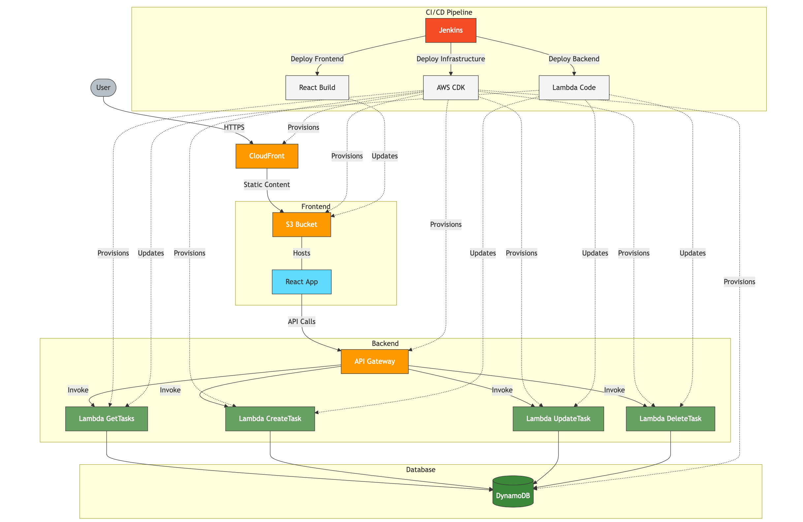

# Serverless Todo Application

[](https://aws.amazon.com/serverless/)
[](https://reactjs.org/)
[](https://aws.amazon.com/cdk/)
[](https://jenkins.io/)
[](https://aws.amazon.com/dynamodb/)

> A modern serverless implementation of a Todo application using AWS services

## 📋 Project Overview

This project demonstrates a complete serverless architecture for a Todo application using AWS services. Instead of using traditional Kubernetes-based infrastructure, this project leverages AWS's serverless offerings to create a scalable, maintainable application with minimal operational overhead and pay-per-use cost model.

### 🏗️ Architecture

The application uses a three-tier architecture implemented entirely with serverless components:

- **Frontend**: React.js application hosted on S3 and distributed via CloudFront
- **Backend**: AWS Lambda functions with API Gateway for serverless API
- **Database**: Amazon DynamoDB for serverless data storage
- **Infrastructure as Code**: AWS CDK for defining and provisioning all resources
- **CI/CD**: Jenkins pipelines for automated deployments of all components

## 🚀 Key Features

- Create, read, update, and delete tasks in a modern UI
- Serverless architecture providing automatic scaling
- Zero server management required
- Infrastructure as Code using TypeScript and AWS CDK
- Continuous Integration and Deployment with Jenkins
- Cost-effective with pay-per-use model (no idle resources)
- High availability and fault tolerance built-in

## 🛠️ Technology Stack

### Frontend
- **React.js**: Modern component-based UI library
- **Material UI**: Component library for consistent design
- **S3**: Static website hosting
- **CloudFront**: Global content delivery network

### Backend
- **AWS Lambda**: Serverless compute (Node.js runtime)
- **API Gateway**: RESTful API management
- **Node.js**: JavaScript runtime
- **AWS SDK**: For interacting with AWS services

### Database
- **DynamoDB**: NoSQL serverless database

### DevOps
- **AWS CDK**: Infrastructure as Code using TypeScript
- **Jenkins**: CI/CD pipelines
- **AWS CloudWatch**: Monitoring and logging

## 📊 Project Structure

```
serverless-todo-app/
├── frontend/             # React application
│   ├── public/           # Static assets
│   ├── src/              # React components and services
│   └── package.json      # Frontend dependencies
├── backend/              # Lambda functions
│   ├── functions/        # Individual Lambda handlers
│   └── package.json      # Backend dependencies
├── infrastructure/       # AWS CDK code
│   ├── bin/              # CDK app entry point
│   ├── lib/              # Stack definitions
│   └── cdk.json          # CDK configuration
└── jenkins/              # CI/CD pipeline definitions
    ├── Jenkinsfile-Infra
    ├── Jenkinsfile-Backend
    └── Jenkinsfile-Frontend
```

## 🚦 Getting Started

### Prerequisites

- AWS Account
- AWS CLI configured
- Node.js and npm
- AWS CDK installed globally
- Jenkins server (for CI/CD)

### Local Development

1. Clone the repository
```bash
git clone https://github.com/yourusername/serverless-todo-app.git
cd serverless-todo-app
```

2. Set up the infrastructure
```bash
cd infrastructure
npm install
npm run build
cdk bootstrap  # Only needed once per AWS account/region
cdk deploy --all
```

3. Set up the backend
```bash
cd ../backend
npm install
# For local testing
sam local start-api # if you have AWS SAM CLI installed
```

4. Set up the frontend
```bash
cd ../frontend
npm install
# Update the API endpoint in .env.local
echo "REACT_APP_API_URL=https://your-api-id.execute-api.your-region.amazonaws.com/prod" > .env.local
npm start
```

### Deployment

Follow the detailed [Implementation Guide](./IMPLEMENTATION.md) for full deployment instructions.

## 🔧 CI/CD Pipeline

The project includes three Jenkins pipelines:

1. **Infrastructure Pipeline**: Deploys AWS resources using CDK
2. **Backend Pipeline**: Deploys Lambda functions
3. **Frontend Pipeline**: Builds and deploys the React application

Each pipeline is triggered automatically when code is pushed to the respective directory in the repository.

## 📈 Architecture Diagram



The architecture diagram shows how the components interact:

1. Users access the application through CloudFront
2. CloudFront serves content from S3
3. The React app makes API calls to API Gateway
4. API Gateway routes requests to Lambda functions
5. Lambda functions interact with DynamoDB
6. Jenkins pipelines automate the deployment of all components

## 💡 Why Serverless?

This architecture provides several advantages over traditional approaches:

- **Cost-efficiency**: Pay only for actual usage, not for idle servers
- **Scalability**: Automatic scaling handles traffic spikes without manual intervention
- **Maintenance**: No patching, updating, or managing servers
- **Reliability**: Built-in high availability and fault tolerance
- **Security**: Managed services with built-in security best practices
- **Developer Experience**: Focus on code, not infrastructure


## Acknowledgements

- [AWS Documentation](https://docs.aws.amazon.com/)
- [AWS CDK Examples](https://github.com/aws-samples/aws-cdk-examples)
- [React Documentation](https://reactjs.org/docs/getting-started.html)
- [Material UI](https://mui.com/)
- [Jenkins Documentation](https://www.jenkins.io/doc/)
